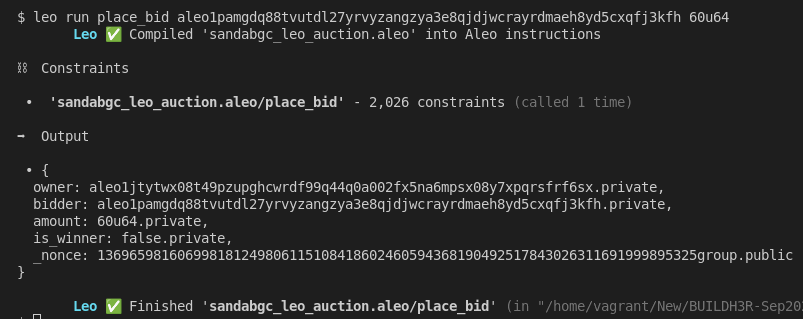
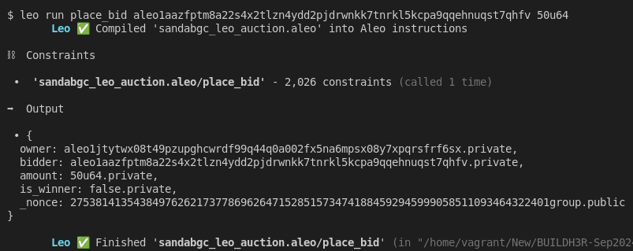
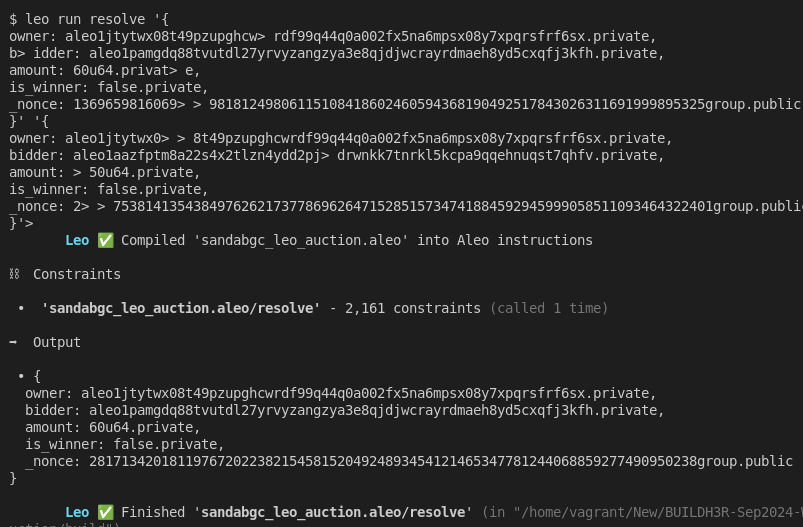
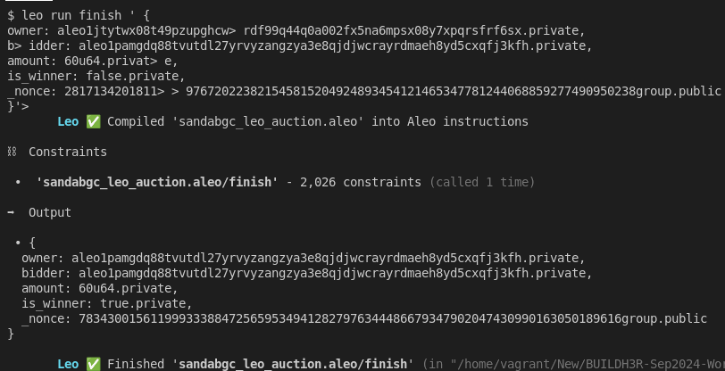
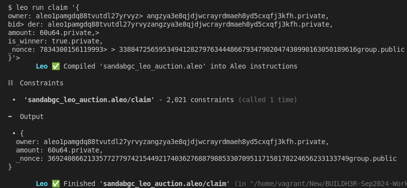
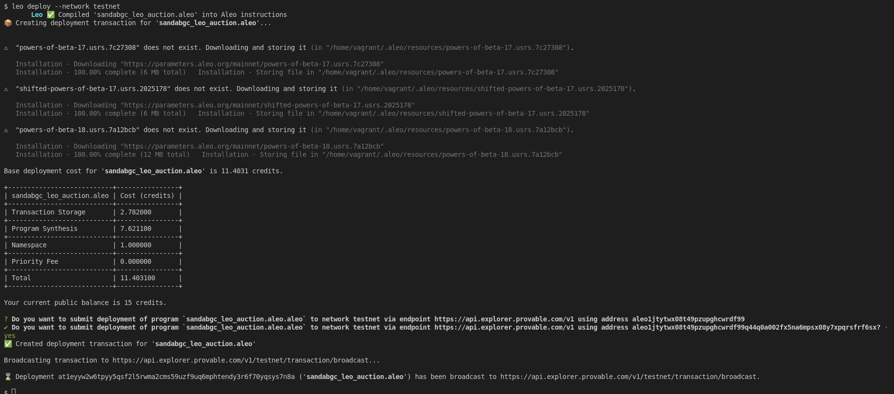
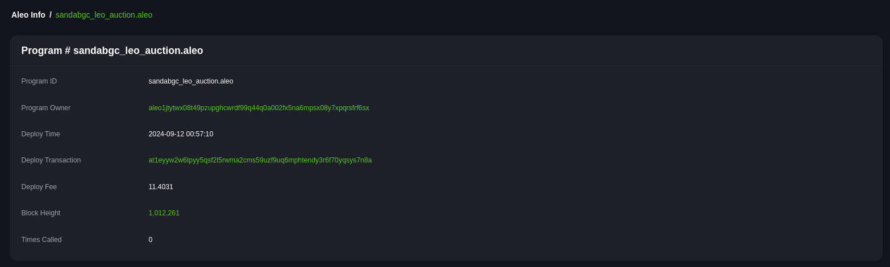

# BUILDH3R Sept Leo
- Discord Link for Use-Case: [https://discord.com/channels/1125877344972849232/1284452543941972028](https://discord.com/channels/1125877344972849232/1284452543941972028)
- [Use-Case Docs](./Discord-Use-Case.md) 


## System Setup
-  Install `rust` locally. Below command will install cli. [More deatils](https://www.rust-lang.org/tools/install)
    ```sh
    curl --proto '=https' --tlsv1.2 -sSf https://sh.rustup.rs | sh
    ```

- Install `leo`. [More Details](https://github.com/ProvableHQ/leo/):
    ```sh
    # Download the source code
    git clone https://github.com/ProvableHQ/leo/
    cd leo
    git checkout testnet-beta
    cargo install --path .
    ```

- Install `SnarkOS`. [More Details](https://github.com/ProvableHQ/snarkOS):
    ```sh
    git clone https://github.com/AleoHQ/snarkOS.git --depth 1
    cd snarkOS
    git checkout testnet-beta
    ./build_ubuntu.sh
    cargo install --path .
    ```

- Install SnarkVM. [More Details](https://github.com/ProvableHQ/snarkVM):
    ```sh
    cargo install snarkvm
    ```

- Make sure all the binaries are added in PATH.

## Create Aleo Project
### Create new project:
- Command:
    ```sh
    leo new sandabgc_leo_auction
    ```

- Since, we are trying to create an auction app, there must be bidder and owner. So let's create 2 bidder account and 1 owner.
- Command:
    ```sh
    snarkos account new
    ```
- So, run above command 3 times in terminal:
    <details><summary> Detailed Output </summary><blockquote>

    ~~~
    $ snarkos account new

    Private Key  <redacted>
        View Key  <redacted>
        Address  aleo1jtytwx08t49pzupghcwrdf99q44q0a002fx5na6mpsx08y7xpqrsfrf6sx

    $ snarkos account new

    Private Key  <redacted>
        View Key  <redacted>
        Address  aleo1pamgdq88tvutdl27yrvyzangzya3e8qjdjwcrayrdmaeh8yd5cxqfj3kfh

    $ snarkos account new

    Private Key  <redacted>
        View Key  <redacted>
        Address  aleo1aazfptm8a22s4x2tlzn4ydd2pjdrwnkk7tnrkl5kcpa9qqehnuqst7qhfv
    ~~~
    
    </blockquote></details>

- In above image, suppose 1 a/c with Address `aleo1jtytwx08t49pzupghcwrdf99q44q0a002fx5na6mpsx08y7xpqrsfrf6sx` is owner and remaining 2nd and 3rd a/cs are bidders. 

- Modify `auction/src/main.leo`. Do not forget to replace owner address in `main.leo` file.

- `.env` is created during the creation of the project. By default, it contains:
    ```sh
    NETWORK=testnet
    PRIVATE_KEY=APrivateKey1zkp8CZNn3yeCseEtxuVPbDCwSyhGW6yZKUYKfgXmcpoGPWH
    ENDPOINT=https://api.explorer.aleo.org/v1
    ```

- Value of Endpoint must be changed with: `https://api.explorer.provable.com/v1`
- New `.env`:
    ```sh
    NETWORK=testnet
    PRIVATE_KEY=APrivateKey1zkp8CZNn3yeCseEtxuVPbDCwSyhGW6yZKUYKfgXmcpoGPWH
    ENDPOINT=https://api.explorer.provable.com/v1
    ```

### Run Test
#### 1st Bid:
- Now, the value of `PRIVATE_KEY` in `.env` must be replaced with the `PRIVATE_KEY` of the 1st bidder.
- Run `place_bid` transaction:
    - Code Snippet:
        ```sh
        leo run place_bid <Address> <Amount>
        ```
    
    - Command:
        ```sh
        leo run place_bid aleo1pamgdq88tvutdl27yrvyzangzya3e8qjdjwcrayrdmaeh8yd5cxqfj3kfh 60u64
        ```
        <details><summary> Detailed Output </summary><blockquote>

        ~~~
        $ leo run place_bid aleo1pamgdq88tvutdl27yrvyzangzya3e8qjdjwcrayrdmaeh8yd5cxqfj3kfh 60u64
            Leo ✅ Compiled 'sandabgc_leo_auction.aleo' into Aleo instructions

        ⛓  Constraints

        •  'sandabgc_leo_auction.aleo/place_bid' - 2,026 constraints (called 1 time)

        ➡️  Output

        • {
        owner: aleo1jtytwx08t49pzupghcwrdf99q44q0a002fx5na6mpsx08y7xpqrsfrf6sx.private,
        bidder: aleo1pamgdq88tvutdl27yrvyzangzya3e8qjdjwcrayrdmaeh8yd5cxqfj3kfh.private,
        amount: 60u64.private,
        is_winner: false.private,
        _nonce: 136965981606998181249806115108418602460594368190492517843026311691999895325group.public
        }

            Leo ✅ Finished 'sandabgc_leo_auction.aleo/place_bid'
        ~~~

        </blockquote></details>
       
        
        
#### 2nd Bid:
- Now, the value of `PRIVATE_KEY` in `.env` must be replaced with the `PRIVATE_KEY` of the 2nd bidder.
- Run `place_bid` transaction:
    - Code Snippet:
        ```sh
        leo run place_bid <Address> <Amount>
        ```
    
    - Command:
        ```sh
        leo run place_bid aleo1aazfptm8a22s4x2tlzn4ydd2pjdrwnkk7tnrkl5kcpa9qqehnuqst7qhfv 50u64
        ```
        <details><summary> Detailed Output </summary><blockquote>

        ~~~
        $ leo run place_bid aleo1aazfptm8a22s4x2tlzn4ydd2pjdrwnkk7tnrkl5kcpa9qqehnuqst7qhfv 50u64
            Leo ✅ Compiled 'sandabgc_leo_auction.aleo' into Aleo instructions

        ⛓  Constraints

        •  'sandabgc_leo_auction.aleo/place_bid' - 2,026 constraints (called 1 time)

        ➡️  Output

        • {
        owner: aleo1jtytwx08t49pzupghcwrdf99q44q0a002fx5na6mpsx08y7xpqrsfrf6sx.private,
        bidder: aleo1aazfptm8a22s4x2tlzn4ydd2pjdrwnkk7tnrkl5kcpa9qqehnuqst7qhfv.private,
        amount: 50u64.private,
        is_winner: false.private,
        _nonce: 2753814135438497626217377869626471528515734741884592945999058511093464322401group.public
        }

            Leo ✅ Finished 'sandabgc_leo_auction.aleo/place_bid'
        ~~~

        </blockquote></details>
       
        

#### Resolve Time:
- Since, both the bidder has succesfully bidded, it is the time of owner to resolve who wins the bid.
- Now, the value of `PRIVATE_KEY` in `.env` must be replaced with the `PRIVATE_KEY` of the owner.
- Run `resolve` transaction:
    - Code Snippet:
        ```sh
        leo run resolve <Output_Of_1st_Bid> <Output_Of_2nd_Bid>
        ```
    
    - Command:
        ```sh
        leo run resolve '{
        owner: aleo1jtytwx08t49pzupghcwrdf99q44q0a002fx5na6mpsx08y7xpqrsfrf6sx.private,
        bidder: aleo1pamgdq88tvutdl27yrvyzangzya3e8qjdjwcrayrdmaeh8yd5cxqfj3kfh.private,
        amount: 60u64.private,
        is_winner: false.private,
        _nonce: 136965981606998181249806115108418602460594368190492517843026311691999895325group.public
        }' '{
        owner: aleo1jtytwx08t49pzupghcwrdf99q44q0a002fx5na6mpsx08y7xpqrsfrf6sx.private,
        bidder: aleo1aazfptm8a22s4x2tlzn4ydd2pjdrwnkk7tnrkl5kcpa9qqehnuqst7qhfv.private,
        amount: 50u64.private,
        is_winner: false.private,
        _nonce: 2753814135438497626217377869626471528515734741884592945999058511093464322401group.public
        }'
        ```
        <details><summary> Detailed Output </summary><blockquote>

        ~~~
        $ leo run resolve '{
        owner: aleo1jtytwx08t49pzupghcw> rdf99q44q0a002fx5na6mpsx08y7xpqrsfrf6sx.private,
        b> idder: aleo1pamgdq88tvutdl27yrvyzangzya3e8qjdjwcrayrdmaeh8yd5cxqfj3kfh.private,
        amount: 60u64.privat> e,
        is_winner: false.private,
        _nonce: 1369659816069> > 98181249806115108418602460594368190492517843026311691999895325group.public
        }' '{
        owner: aleo1jtytwx0> > 8t49pzupghcwrdf99q44q0a002fx5na6mpsx08y7xpqrsfrf6sx.private,
        bidder: aleo1aazfptm8a22s4x2tlzn4ydd2pj> drwnkk7tnrkl5kcpa9qqehnuqst7qhfv.private,
        amount: > 50u64.private,
        is_winner: false.private,
        _nonce: 2> > 753814135438497626217377869626471528515734741884592945999058511093464322401group.public
        }'> 
            Leo ✅ Compiled 'sandabgc_leo_auction.aleo' into Aleo instructions

        ⛓  Constraints

        •  'sandabgc_leo_auction.aleo/resolve' - 2,161 constraints (called 1 time)

        ➡️  Output

        • {
        owner: aleo1jtytwx08t49pzupghcwrdf99q44q0a002fx5na6mpsx08y7xpqrsfrf6sx.private,
        bidder: aleo1pamgdq88tvutdl27yrvyzangzya3e8qjdjwcrayrdmaeh8yd5cxqfj3kfh.private,
        amount: 60u64.private,
        is_winner: false.private,
        _nonce: 2817134201811976720223821545815204924893454121465347781244068859277490950238group.public
        }

            Leo ✅ Finished 'sandabgc_leo_auction.aleo/resolve'
        ~~~

        </blockquote></details>
       
        

#### Finish Bid:
- Keep same `.env` as we are running as owner.
- Run `finish` transaction:
    - Code Snippet:
        ```sh
        leo run finish <Resolve_Bid>
        ```
    
    - Command:
        ```sh
        leo run finish ' {
        owner: aleo1jtytwx08t49pzupghcwrdf99q44q0a002fx5na6mpsx08y7xpqrsfrf6sx.private,
        bidder: aleo1pamgdq88tvutdl27yrvyzangzya3e8qjdjwcrayrdmaeh8yd5cxqfj3kfh.private,
        amount: 60u64.private,
        is_winner: false.private,
        _nonce: 2817134201811976720223821545815204924893454121465347781244068859277490950238group.public
        }'
        ```
        <details><summary> Detailed Output </summary><blockquote>

        ~~~
        $ leo run finish ' {
        owner: aleo1jtytwx08t49pzupghcw> rdf99q44q0a002fx5na6mpsx08y7xpqrsfrf6sx.private,
        b> idder: aleo1pamgdq88tvutdl27yrvyzangzya3e8qjdjwcrayrdmaeh8yd5cxqfj3kfh.private,
        amount: 60u64.privat> e,
        is_winner: false.private,
        _nonce: 2817134201811> > 976720223821545815204924893454121465347781244068859277490950238group.public
        }'> 
            Leo ✅ Compiled 'sandabgc_leo_auction.aleo' into Aleo instructions

        ⛓  Constraints

        •  'sandabgc_leo_auction.aleo/finish' - 2,026 constraints (called 1 time)

        ➡️  Output

        • {
        owner: aleo1pamgdq88tvutdl27yrvyzangzya3e8qjdjwcrayrdmaeh8yd5cxqfj3kfh.private,
        bidder: aleo1pamgdq88tvutdl27yrvyzangzya3e8qjdjwcrayrdmaeh8yd5cxqfj3kfh.private,
        amount: 60u64.private,
        is_winner: true.private,
        _nonce: 7834300156119993338847256595349412827976344486679347902047430990163050189616group.public
        }

            Leo ✅ Finished 'sandabgc_leo_auction.aleo/finish'
        ~~~

        </blockquote></details>
       
        

    - According to above outputs, a/c with `Address`: `aleo1pamgdq88tvutdl27yrvyzangzya3e8qjdjwcrayrdmaeh8yd5cxqfj3kfh` is the winner and is new owner.

#### Claim Bid:
- Now, the value of `PRIVATE_KEY` in `.env` must be replaced with the `PRIVATE_KEY` of the owner `aleo1pamgdq88tvutdl27yrvyzangzya3e8qjdjwcrayrdmaeh8yd5cxqfj3kfh`.
- Run `claim` transaction:
    - Code Snippet:
        ```sh
        leo run claim <Finish_Bid>
        ```
    
    - Command:
        ```sh
        leo run claim '{
        owner: aleo1pamgdq88tvutdl27yrvyzangzya3e8qjdjwcrayrdmaeh8yd5cxqfj3kfh.private,
        bidder: aleo1pamgdq88tvutdl27yrvyzangzya3e8qjdjwcrayrdmaeh8yd5cxqfj3kfh.private,
        amount: 60u64.private,
        is_winner: true.private,
        _nonce: 7834300156119993338847256595349412827976344486679347902047430990163050189616group.public
        }'
        ```
        <details><summary> Detailed Output </summary><blockquote>

        ~~~
        $ leo run claim '{
        owner: aleo1pamgdq88tvutdl27yrvyz> angzya3e8qjdjwcrayrdmaeh8yd5cxqfj3kfh.private,
        bid> der: aleo1pamgdq88tvutdl27yrvyzangzya3e8qjdjwcrayrdmaeh8yd5cxqfj3kfh.private,
        amount: 60u64.private,> 
        is_winner: true.private,
        _nonce: 7834300156119993> > 338847256595349412827976344486679347902047430990163050189616group.public
        }'> 
            Leo ✅ Compiled 'sandabgc_leo_auction.aleo' into Aleo instructions

        ⛓  Constraints

        •  'sandabgc_leo_auction.aleo/claim' - 2,021 constraints (called 1 time)

        ➡️  Output

        • {
        owner: aleo1pamgdq88tvutdl27yrvyzangzya3e8qjdjwcrayrdmaeh8yd5cxqfj3kfh.private,
        amount: 60u64.private,
        _nonce: 3692408662133577277974215449217403627688798853307095117158178224656233133749group.public
        }

            Leo ✅ Finished 'sandabgc_leo_auction.aleo/claim'
        ~~~

        </blockquote></details>
       
        

#### Deploy To Testnet:
- Command:
    ```sh
    leo deploy --network testnet
    ```


    <details><summary> Detailed Output </summary><blockquote>

    ~~~
    $ leo deploy --network testnet
        Leo ✅ Compiled 'sandabgc_leo_auction.aleo' into Aleo instructions
    📦 Creating deployment transaction for 'sandabgc_leo_auction.aleo'...


    ⚠️  "powers-of-beta-17.usrs.7c27308" does not exist. Downloading and storing it (in "/home/vagrant/.aleo/resources/powers-of-beta-17.usrs.7c27308").

    Installation - Downloading "https://parameters.aleo.org/mainnet/powers-of-beta-17.usrs.7c27308"
    Installation - 100.00% complete (6 MB total)   Installation - Storing file in "/home/vagrant/.aleo/resources/powers-of-beta-17.usrs.7c27308"

    ⚠️  "shifted-powers-of-beta-17.usrs.2025178" does not exist. Downloading and storing it (in "/home/vagrant/.aleo/resources/shifted-powers-of-beta-17.usrs.2025178").

    Installation - Downloading "https://parameters.aleo.org/mainnet/shifted-powers-of-beta-17.usrs.2025178"
    Installation - 100.00% complete (6 MB total)   Installation - Storing file in "/home/vagrant/.aleo/resources/shifted-powers-of-beta-17.usrs.2025178"

    ⚠️  "powers-of-beta-18.usrs.7a12bcb" does not exist. Downloading and storing it (in "/home/vagrant/.aleo/resources/powers-of-beta-18.usrs.7a12bcb").

    Installation - Downloading "https://parameters.aleo.org/mainnet/powers-of-beta-18.usrs.7a12bcb"
    Installation - 100.00% complete (12 MB total)   Installation - Storing file in "/home/vagrant/.aleo/resources/powers-of-beta-18.usrs.7a12bcb"

    Base deployment cost for 'sandabgc_leo_auction.aleo' is 11.4031 credits.

    +---------------------------+----------------+
    | sandabgc_leo_auction.aleo | Cost (credits) |
    +---------------------------+----------------+
    | Transaction Storage       | 2.782000       |
    +---------------------------+----------------+
    | Program Synthesis         | 7.621100       |
    +---------------------------+----------------+
    | Namespace                 | 1.000000       |
    +---------------------------+----------------+
    | Priority Fee              | 0.000000       |
    +---------------------------+----------------+
    | Total                     | 11.403100      |
    +---------------------------+----------------+

    Your current public balance is 15 credits.

    ? Do you want to submit deployment of program `sandabgc_leo_auction.aleo.aleo` to network testnet via endpoint https://api.explorer.provable.com/v1 using address aleo1jtytwx08t49pzupghcwrdf99
    ✔ Do you want to submit deployment of program `sandabgc_leo_auction.aleo.aleo` to network testnet via endpoint https://api.explorer.provable.com/v1 using address aleo1jtytwx08t49pzupghcwrdf99q44q0a002fx5na6mpsx08y7xpqrsfrf6sx? · yes
    ✅ Created deployment transaction for 'sandabgc_leo_auction.aleo'

    Broadcasting transaction to https://api.explorer.provable.com/v1/testnet/transaction/broadcast...

    ⌛ Deployment at1eyyw2w6tpyy5qsf2l5rwma2cms59uzf9uq6mphtendy3r6f70yqsys7n8a ('sandabgc_leo_auction.aleo') has been broadcast to https://api.explorer.provable.com/v1/testnet/transaction/broadcast.
    ~~~

    </blockquote></details>

    


- Links: 
    - Aleo Program: [https://testnet.aleo.info/program/sandabgc_leo_auction.aleo](https://testnet.aleo.info/program/sandabgc_leo_auction.aleo)
    - Deploy Txn: [https://testnet.aleo.info/transition/au1futc3xm2jj8pffn6uz3c7thna9uyzyrxfg4ncca554t3gram7cqsnlu6m0](https://testnet.aleo.info/transition/au1futc3xm2jj8pffn6uz3c7thna9uyzyrxfg4ncca554t3gram7cqsnlu6m0) 

    