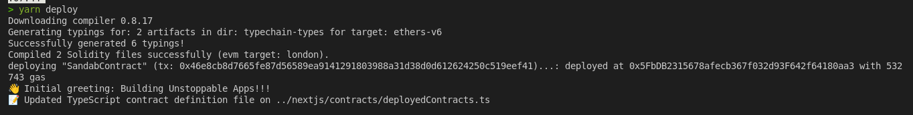
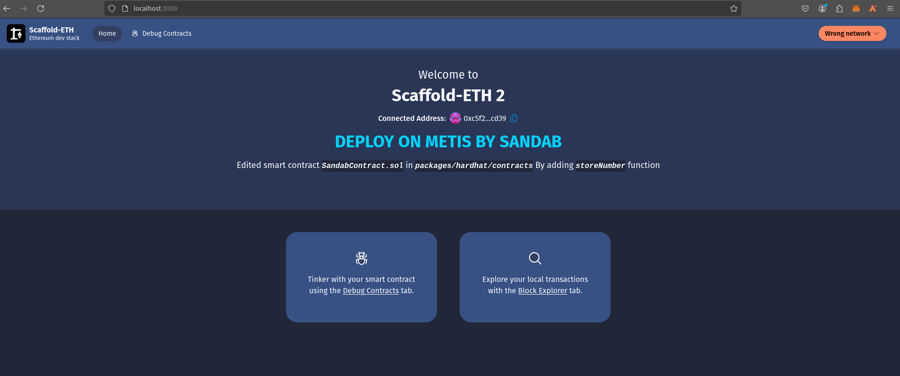
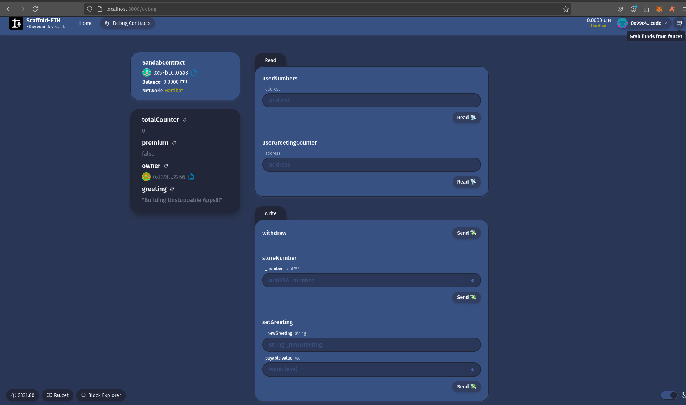
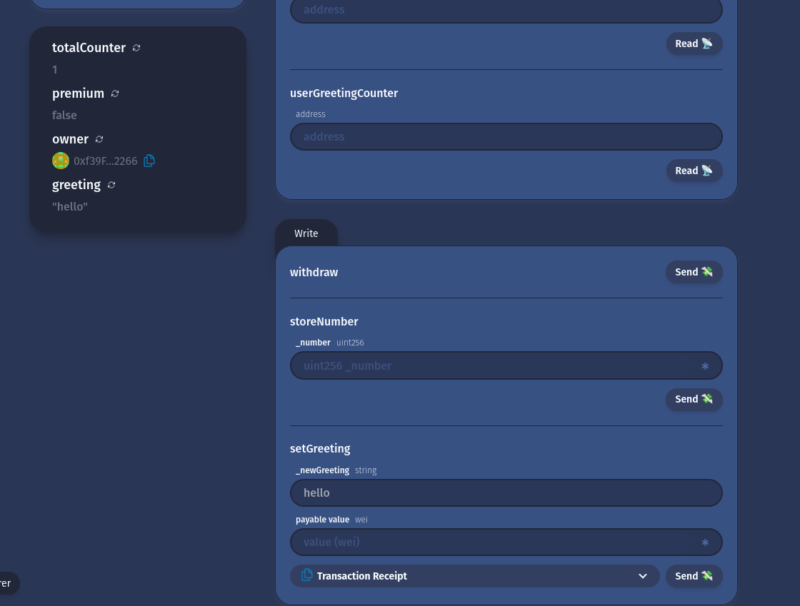
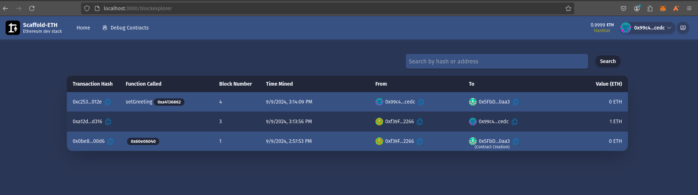
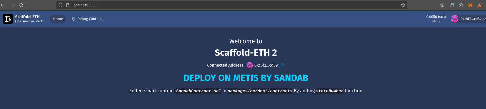

# BUILDH3R Sept Metis

- Clone Template Repo:
    ```sh
    git clone https://github.com/scaffold-eth/scaffold-eth-2.git
    cd scaffold-eth-2 && rm -rf .git
    ```

## Setup hardhat network for Local development:
### Install packages:
- Command:
    ```sh
    yarn install
    ```

### Start local Network:
- Do not close this tab. Command:
    ```sh
    yarn chain
    ```


### Deploy Contract:
- Command:
    ```sh
    yarn deploy
    ```

- Output:
    <details><summary> Detailed Output </summary><blockquote>

    ~~~
    > yarn deploy     
    Downloading compiler 0.8.17
    Generating typings for: 2 artifacts in dir: typechain-types for target: ethers-v6
    Successfully generated 6 typings!
    Compiled 2 Solidity files successfully (evm target: london).
    deploying "SandabContract" (tx: 0x46e8cb8d7665fe87d56589ea9141291803988a31d38d0d612624250c519eef41)...: deployed at 0x5FbDB2315678afecb367f032d93F642f64180aa3 with 532743 gas
    👋 Initial greeting: Building Unstoppable Apps!!!
    📝 Updated TypeScript contract definition file on ../nextjs/contracts/deployedContracts.ts
    ~~~

    </blockquote></details>

    

### Start Frontend:
- Command:
    ```sh
    yarn start
    ```
- We can verify our app is running in `http://localhost:3000`


### Modify Frontend:

- Edit `packages/nextjs/app/page.tsx` file:
    ```javascript
    </div>
        <p className="text-center text-lg mt-4">
        <strong style={{ fontSize: '36px', color: '#04D1fF'}}>DEPLOY ON METIS BY SANDAB</strong>
        </p>
        {/* <p className="text-center text-lg">
        Get started by editing{" "}
        <code className="italic bg-base-300 text-base font-bold max-w-full break-words break-all inline-block">
            packages/nextjs/app/page.tsx
        </code>
        </p> */}
        <p className="text-center text-lg">
        Edited smart contract{" "}
        <code className="italic bg-base-300 text-base font-bold max-w-full break-words break-all inline-block">
            SandabContract.sol
        </code>{" "}
        in{" "}
        <code className="italic bg-base-300 text-base font-bold max-w-full break-words break-all inline-block">
            packages/hardhat/contracts
        </code>{ " "}
        By adding <code className="italic bg-base-300 text-base font-bold max-w-full break-words break-all inline-block">storeNumber</code> function
        </p>
    </div>
    ```

### Modify Backend:
- Edit `packages/hardhat/contracts`:
    ```javascript
    /**
    * Function that allows the owner to withdraw all the Ether in the contract
    * The function can only be called by the owner of the contract as defined by the isOwner modifier
    */
    function withdraw() public isOwner {
        (bool success, ) = owner.call{ value: address(this).balance }("");
        require(success, "Failed to send Ether");
    }
    // Mapping from address to number
    mapping(address => uint) public userNumbers;
    event NumberUpdated(address indexed user, uint number);
    // Function to store a number
    function storeNumber(uint _number) public {
        userNumbers[msg.sender] = _number;
        emit NumberUpdated(msg.sender, _number);
    }
    ```


### Re-Deploy Contract:
- Make sure `yarn chain` is running in background tab:
    ```sh
    yarn deploy
    ```

    Output:
    <details><summary> Detailed Output </summary><blockquote>

    ~~~
    > yarn deploy\
    > ; 
    Nothing to compile
    No need to generate any newer typings.
    deploying "SandabContract" (tx: 0x0be89bfd087042b4473ca541cf3d8767c70ec903ed712f65e1054bcaf79f00d6)...: deployed at 0x5FbDB2315678afecb367f032d93F642f64180aa3 with 574168 gas
    👋 Initial greeting: Building Unstoppable Apps!!!
    📝 Updated TypeScript contract definition file on ../nextjs/contracts/deployedContracts.ts
    ~~~
 
    </blockquote></details>


### Verify:
- Visit [http://localhost:3000](http://localhost:3000):
    

- Visit: [http://localhost:3000/debug](http://localhost:3000/debug):
    

- Create new Greet:

    

- Blockexplorer [http://localhost:3000/blockexplorer](http://localhost:3000/blockexplorer):\
    


## Deploy To Metis Sepolia Network:
### Generate Account:
- Command:
    ```sh
    yarn generate
    ```

    <details><summary> Detailed Output </summary><blockquote>

    ~~~
    > yarn generate
    👛 Generating new Wallet
    📄 Private Key saved to packages/hardhat/.env file
    🪄 Generated wallet address: 0xc5f2517C33E48a2CB0081E2fCa2a5FA699b2cd39
    ~~~

    </blockquote></details>


### Faucet Link:
- https://faucet-427702.uc.r.appspot.com/

### Add Metis Sepolia Config to `Hardhat.config.ts` file:
- Code Snippet:
    ```typescript
    andromeda : {
      url: "https://andromeda.metis.io/?owner=1888",
      accounts: [deployerPrivateKey],
      verify: {
        etherscan: {
          apiKey: "apikey is not required, just set a placeholder",
          apiUrl: "https://api.routescan.io/v2/network/mainnet/evm/1088/etherscan",
        },
      },
    },
    metisSepolia: {
      url: "https://sepolia.metisdevops.link/",
      accounts: [deployerPrivateKey],
        verify: {
          etherscan: {
            apiKey: "apikey is not required, just set a placeholder", 
            apiUrl: "https://sepolia.explorer.metisdevops.link",
          },
        },
    },
    ```

### Deploy contract to Metis Sepolia Network:
- Command:
    ```sh
    yarn deploy --network metisSepolia
    ```

    <details><summary> Detailed Output </summary><blockquote>

    ~~~
    > yarn deploy --network metisSepolia
    Nothing to compile
    No need to generate any newer typings.
    deploying "SandabContract"
    (tx: 0x23ddfce17ef6531579fbe107de71086f3c87bdad506f74832eea6115ad8a24b9)...: deployed at 0x2F5Daa23ea2C99e76C013de0238d05Ca3d127f7e with 573988 gas
    👋 Initial greeting: Building Unstoppable Apps!!!
    📝 Updated TypeScript contract definition file on ../nextjs/contracts/deployedContracts.ts
    ~~~

    </blockquote></details>
    
    

- Here, 
    - Contract Address: `0x2F5Daa23ea2C99e76C013de0238d05Ca3d127f7e`
    - Txn Hash: `0x23ddfce17ef6531579fbe107de71086f3c87bdad506f74832eea6115ad8a24b9`
    - Txn Link: [https://sepolia-explorer.metisdevops.link/tx/0x23ddfce17ef6531579fbe107de71086f3c87bdad506f74832eea6115ad8a24b9](https://sepolia-explorer.metisdevops.link/tx/0x23ddfce17ef6531579fbe107de71086f3c87bdad506f74832eea6115ad8a24b9)


### Deploy contract to Metis Andromeda  Network:
- Command:
    ```sh
    yarn deploy --network andromeda
    ```

    <details><summary> Detailed Output </summary><blockquote>

    ~~~
    > yarn deploy --network andromeda
    Generating typings for: 2 artifacts in dir: typechain-types for target: ethers-v6
    Successfully generated 6 typings!
    Compiled 2 Solidity files successfully (evm target: london).
    deploying "SandabContract"
     (tx: 0x674e6037b6a8e999e1e0090f1352d213f6ff41929eda08424422252044faf2a8)...: deployed at 0x2F5Daa23ea2C99e76C013de0238d05Ca3d127f7e with 573988 gas
    👋 Initial greeting: Building Unstoppable Apps!!!
    📝 Updated TypeScript contract definition file on ../nextjs/contracts/deployedContracts.ts
    ~~~

    </blockquote></details>
    
    

- Here, 
    - Contract Address: `0x2F5Daa23ea2C99e76C013de0238d05Ca3d127f7e`
    - Txn Hash: `0x674e6037b6a8e999e1e0090f1352d213f6ff41929eda08424422252044faf2a8`
    - Txn Link: [https://andromeda-explorer.metis.io/tx/0x674e6037b6a8e999e1e0090f1352d213f6ff41929eda08424422252044faf2a8](https://andromeda-explorer.metis.io/tx/0x674e6037b6a8e999e1e0090f1352d213f6ff41929eda08424422252044faf2a8)


### Update Frontend for Metis:
- Edit `/packages/nextjs/scaffold.config.ts`:
    ```javascript
    targetNetworks: [chains.metis],
    ```

- Visit [http://localhost:3000](http://localhost:3000). Confirm our UI is connected to Metis Network instead of Hardhat network:
    
    
